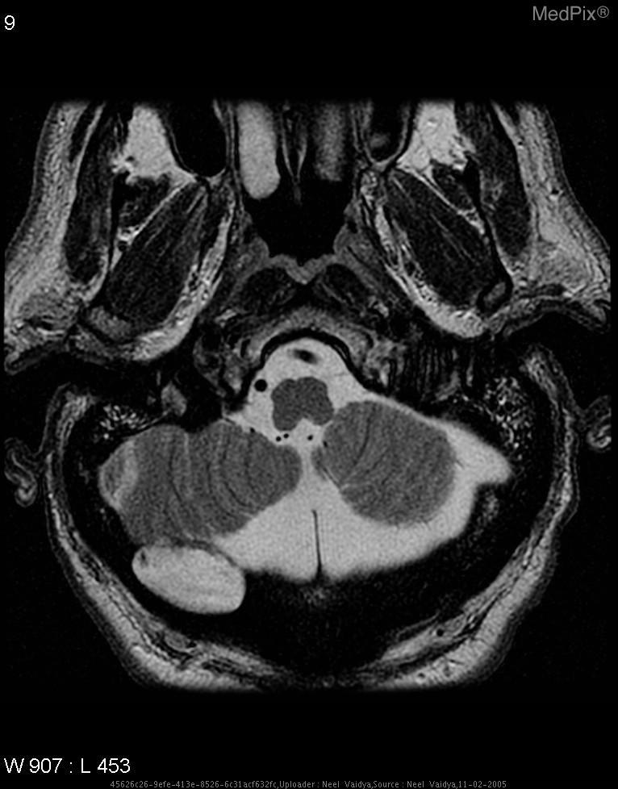

# Sage

A small(0.5B) multimodal VLM finetuned on quetion-and-answers on radiology images. Fine-tuned on a NVIDIA-T4 :(

Download the weights here: https://huggingface.co/0VISH0/Sage

## Dataset
https://huggingface.co/datasets/flaviagiammarino/vqa-rad

---
| Image | Example |
|-------|---------|
|  | **is the lesion causing significant brainstem herniation?** no|
---

## Architecture
- Siglip vision encoder
- Qwen language model